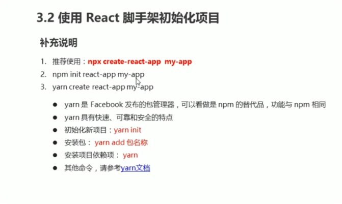
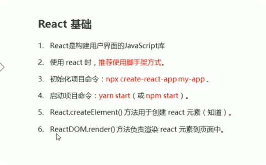
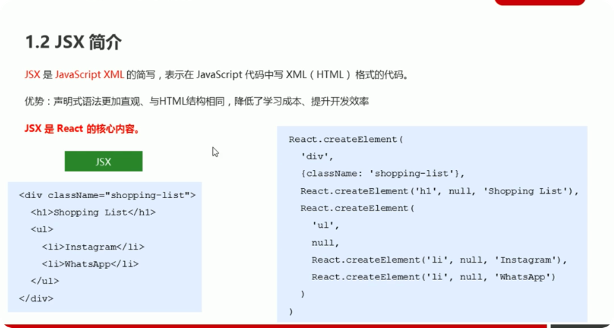
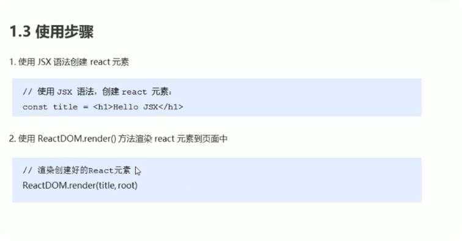

# react
* 是一个用于构建用户界面的js库

* 特点： 声明式，基于组件，学习一次，随处使用


# react使用

```
<!DOCTYPE html>
<html lang="en">

<head>
    <meta charset="utf-8">
    <meta name="viewport" content="width=device-width, initial-scale=1.0">
    <meta http-equiv="X-UA-Compatible" content="ie-edge">
    <title>react基本使用</title>
</head>

<body>

    <div id="root"></div>
    <!-- 1.引入js文件 -->
    <script src="./node_modules/react/umd/react.development.js"></script>
    <script src="./node_modules/react-dom/umd/react-dom.development.js"></script>

    <script>
        // 2.创建react元素
        // 参数一：元素名称
        // 参数二：元素属性
        // 参数三以及以后的参数： 元素的子节点
        // const title = React.createElement('h1', null, 'Hello React')
        const title = React.createElement('p', {
            title: '我是标题',
            id: 'p1'
        }, 'Hello React', React.createElement('span', null, '我是span节点'))

        // 3 渲染react元素
        //参数一：要渲染的react元素
        //参数二：挂载点
        ReactDOM.render(title, document.getElementById('root'))
    </script>
</body>

</html>
```


# react 脚手架
* 脚手架是开发现代web应用的设备
* 充分利用webpack, babel, eslint等工具辅助项目开发
* react脚手架零配置，无需手动配置繁琐的工具即可使用
* 关注业务，而不是工具配置

##### 初始化项目: npx create-react-app my-app
* 启动项目， 在项目根目录执行：npm start (cd my-app)



##### 在脚手架中使用react
1. 导入react和react-dom两个包
2. 创建react元素
3. 渲染


# jsx javascript xml的简写，表示在javascript代码中写xml(html)格式的代码
* jsx 是react的核心内容
* createElement()的问题

```
<!-- 1.使用jsx语法创建react元素 -->
const title = <h1>Hello JSX</h1>

<!-- 2. 使用ReactDOM.render()方法渲染react元素到页面中 -->
```

* 推荐使用jsx语法创建react元素
* 写jsx和写html一样，更加直观
* jsx语法更能体现react声明式特点(描述ui长什么样子)
```
const title = <h1>hello jsx</h1>
ReactDom.render(title,root)
```
# 为什么脚手架中可以使用jsx语法？
* jsx不是标准的ecmascript语法，它是ecmascript的语法扩展
* 需要使用babel编译处理后，才能在浏览器环境中使用
* creat-react-app 脚手架中已经默认有盖配置，无需手动配置
* 编译jsx语法的包为: @babel/preset-react

# jsx 注意点
* 驼峰命名法
* 特殊属性名： class - className, for - htmlFor, tabindex - tabIndex
* 没有子节点的react可以用/>结束
* 推荐：使用小括号包裹jsx, 从而避免js的自动插入分号陷阱
```
const dv = (
    <div>hello jsx</div>
)
```