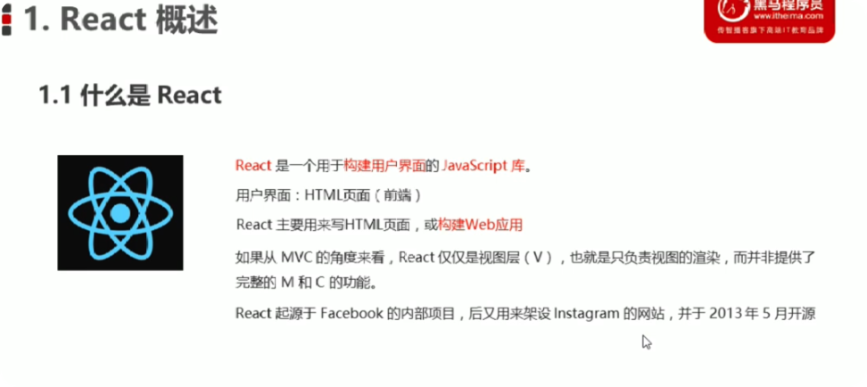

# react
* 是一个用于构建用户界面的js库

* 特点： 声明式，基于组件，学习一次，随处使用


##### react使用

```
<!DOCTYPE html>
<html lang="en">

<head>
    <meta charset="utf-8">
    <meta name="viewport" content="width=device-width, initial-scale=1.0">
    <meta http-equiv="X-UA-Compatible" content="ie-edge">
    <title>react基本使用</title>
</head>

<body>

    <div id="root"></div>
    <!-- 1.引入js文件 -->
    <script src="./node_modules/react/umd/react.development.js"></script>
    <script src="./node_modules/react-dom/umd/react-dom.development.js"></script>

    <script>
        // 2.创建react元素
        // 参数一：元素名称
        // 参数二：元素属性
        // 参数三： 元素的子节点
        const title = React.createElement('h1', null, 'Hello React')

        // 3 渲染react元素
        //参数一：要渲染的react元素
        //参数二：挂载点
        ReactDOM.render(title, document.getElementById('root'))
    </script>
</body>

</html>
```
